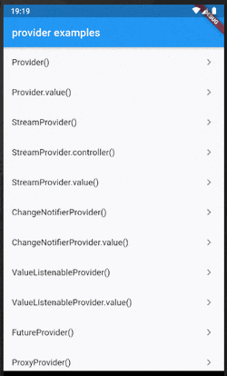
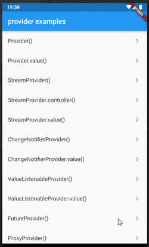
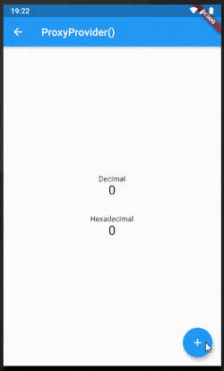
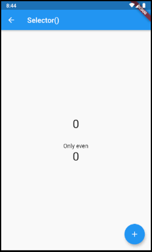

# Examples of Flutter's provider package

This repository shows how to use the provider package.

Each example is described in my articles below:

* [[Flutter] package:provider の各プロバイダの詳細 - Qiita](https://qiita.com/kabochapo/items/a90d8438243c27e2f6d9)
* [【Flutter】依存オブジェクトの注入 - のんびり精進](https://kabochapo.hateblo.jp/entry/2019/07/01/211953)

See also the official documentation for more detailed information:

* [provider | Flutter Package](https://pub.dev/packages/provider)
